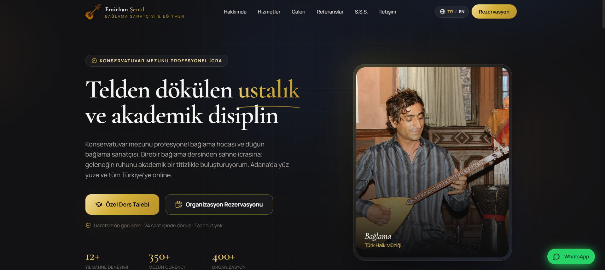

# 🪕 Emirhan Şenol — Bağlama Sanatçısı Dijital Vitrini

**Konservatuvar mezunu profesyonel bir bağlama sanatçısı için premium, tek sayfalık dijital vitrin.**
Özel ders talepleri ve düğün & kurumsal organizasyon rezervasyonlarını tek noktada toplar.

 

### 🔗 [**▶ CANLI DEMO — omerbozkurt.github.io/sanatci-dijital-vitrin**](https://omerbozkurt.github.io/sanatci-dijital-vitrin/)

 

 

---

## ✨ Vitrin

Geleneksel enstrüman ruhunu modern akademik bir vizyonla harmanlayan, **koyu antrasit + gece mavisi** zemin üzerine **premium gold** vurgularla tasarlanmış lüks bir arayüz. Cam efekti (glassmorphism), yumuşak mikro etkileşimler ve bol beyaz alan ile premium segmentte bir marka deneyimi sunar.

> 🎯 **Amaç:** Karşılamada *"Konservatuvar Mezunu Profesyonel İcra"* vurgusuyla anında güven (otorite) inşa etmek ve ziyaretçiyi iki net yola — **Özel Ders** veya **Organizasyon Rezervasyonu** — yönlendirmek.

---

## 🧩 Bölümler

| Bölüm | İçerik |
|------|--------|
| **Sticky Header** | Blurlu arka plan, TR/EN dil seçimi, arka plansız PNG logo |
| **Hero** | Otorite vurgusu + zıt iki CTA: `Özel Ders Talebi` / `Organizasyon Rezervasyonu` |
| **Hakkımda** | Akademik geçmiş odaklı biyografi ve portre |
| **Hizmetler** | İki premium kart: *Özel Ders Müfredatı* & *Sahne & Organizasyon Konseptleri* |
| **Galeri** | Bağlama temalı performans görselleriyle asimetrik grid |
| **Referanslar** | Öğrenci ve etkinlik sahiplerinden sosyal kanıt |
| **S.S.S.** | Dönüşüm odaklı sıkça sorulan sorular (accordion) |
| **İletişim** | Akıllı rezervasyon formu → WhatsApp aktarımı + sabit WhatsApp butonu |

---

## 🎨 Tasarım Sistemi

| Öğe | Değer |
|-----|-------|
| **Zemin** | Koyu antrasit `#121214` · gece mavisi tonları |
| **Vurgu** | Premium gold `#D4AF37` · sıcak bakır/ahşap tınıları |
| **Tipografi** | *Cormorant Garamond* (display serif) + *Manrope* (gövde) |
| **Efektler** | Glassmorphism, yumuşak gölgeler, scroll-reveal, hover mikro etkileşimleri |
| **Düzen** | Asimetrik & doğrusal akış, bol beyaz alan, tam responsive |

---

## 🚀 Öne Çıkanlar

- **Dönüşüm odaklı pazarlama** — otorite vurgusu, zıtlık ilkesiyle çift CTA, güven mikro-kopisi, sosyal kanıt, form→WhatsApp akışı.
- **Kusursuz SEO** — semantik HTML5, meta + Open Graph, **JSON-LD** yapısal verisi (`MusicGroup`, `ProfessionalService`, `FAQPage`), `robots.txt` ve `sitemap.xml`.
- **Çok dilli (i18n)** — TR (varsayılan) / EN anında dil değişimi, `localStorage` kalıcılığı.
- **Erişilebilirlik** — odak halkaları, `aria` etiketleri, `prefers-reduced-motion`, 44px+ dokunma hedefleri.
- **Performans** — Vite ile optimize üretim derlemesi, lazy-load görseller.

---

## 🛠️ Teknolojiler

**React 18** · **Vite** · **Tailwind CSS** · **lucide-react** · **GitHub Actions** (otomatik dağıtım)

---

## 📄 Lisans

Telif Hakkı © 2026 **Ömer Bozkurt**. Tüm hakları saklıdır.

Bu proje **tescilli (proprietary)** bir lisansla korunmaktadır. Hak sahibinin önceden yazılı izni olmadan kopyalanması, dağıtılması, değiştirilmesi veya ticari amaçla kullanılması yasaktır. Ayrıntılar için [LICENSE](LICENSE) dosyasına bakın.

İzin / lisans talepleri: **25omerbozkurt@gmail.com**
